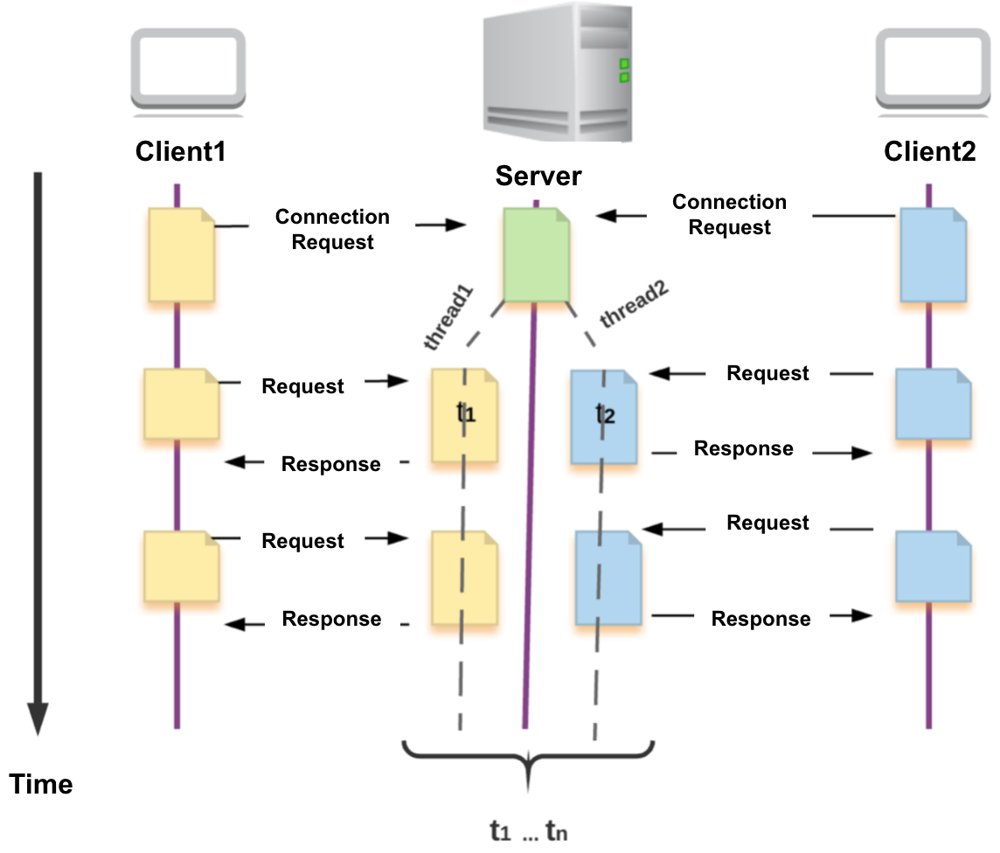
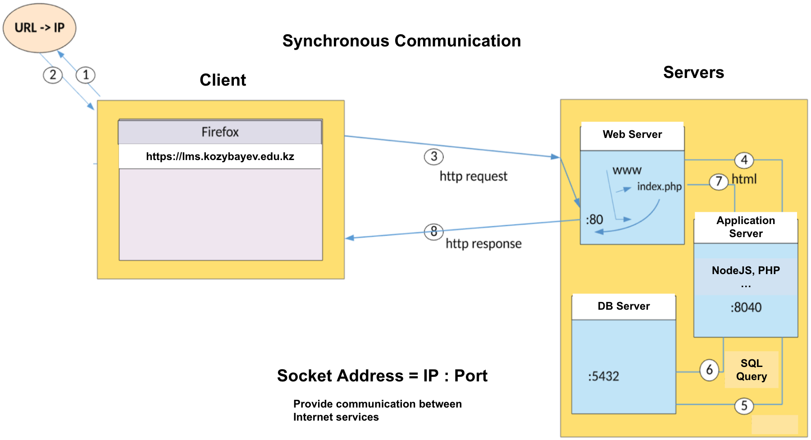
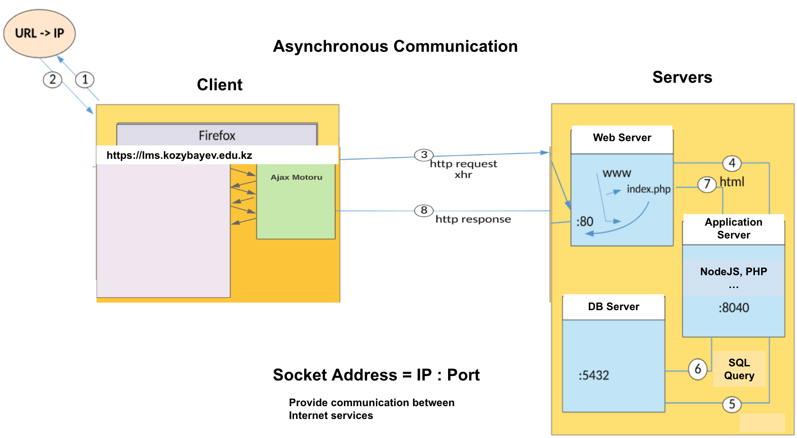
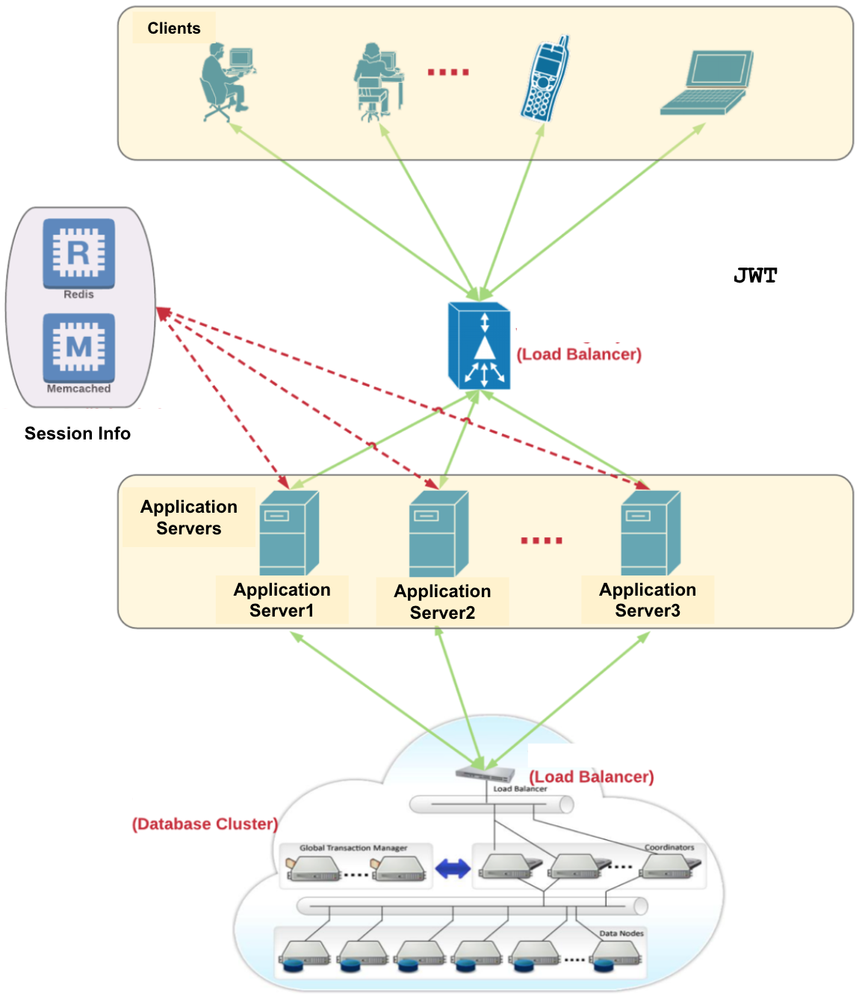
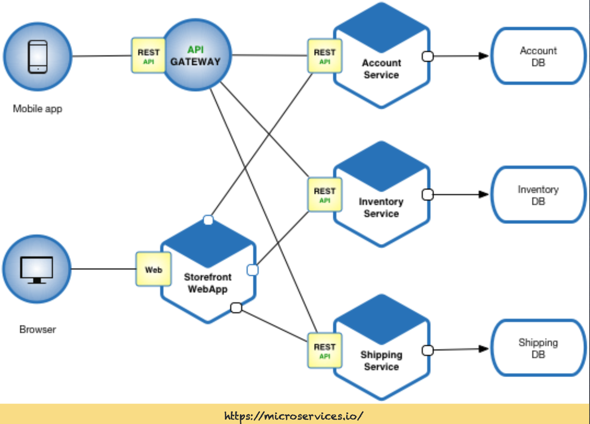

# Module 3: Web Applications And Web Services


## Part 1: Fundamentals Of Web Applications And Web Services

There are several services on the Internet, and the **Web (World Wide Web)** is one of the most widely used. The web consists of websites, web pages, and online resources that people can access using a web browser.

### **What is a URL?**
A **URL (Uniform Resource Locator)** is the address of a webpage or resource on the web. It tells your browser **where to find** and **how to access** a specific resource.

### **Parts of a URL:**
A URL typically consists of:
- **Protocol:** Defines how to access the resource (e.g., `https://`, `http://`).
- **Domain Name:** The website's name (e.g., `example.com`).
- **Path (Optional):** Specifies a specific page or file (e.g., `/about`).

#### **Example URL:**
`https://www.example.com/about`
- `https://` → Secure protocol
- `www.example.com` → Website domain
- `/about` → Specific page

A URL acts like an address for finding and retrieving web resources, allowing users to navigate the internet efficiently.  

### Client Server Architecture


### Three-tier Web Architecture


The **Three-Tier Web Architecture** is a software architecture pattern that separates an application into three logical layers:

1. **Presentation Tier (Client Layer)** – The front-end where users interact with the application (e.g., web browser, mobile app).
2. **Application Tier (Business Logic Layer)** – The back-end server that processes requests and enforces business rules.
3. **Data Tier (Database Layer)** – The database that stores and retrieves data.


```plaintext
+---------------------------+
|   Presentation Tier       |
|  [ HTML / CSS / JS ]      |
+---------------------------+
            │
            ▼
+---------------------------+
|   Application Tier        |
|  [ Node.js / Python ]     |
+---------------------------+
            │
            ▼
+---------------------------+
|   Data Tier               |
|  [ MySQL/PostgreSQL]      |
+---------------------------+

Diagram Representation of Three-Tier Web Architecture

```

### Web Application Architecture - Synchronous Communication



### Web Application Architecture - Asynchronous Communication



### Scalable Web Application Architecture 



### Service-Oriented Architecture (SOA)

**Service-Oriented Architecture (SOA)** is a design pattern where software components (services) provide functionality to other components over a network. Each service is a discrete unit of functionality, which can be independently developed, deployed, and maintained. Services communicate with each other using well-defined interfaces and protocols, typically over HTTP or messaging queues.

#### Key Characteristics of SOA:
- **Loose Coupling**: Services are designed to be independent, minimizing dependencies.
- **Interoperability**: Services can work across different platforms and technologies.
- **Reusability**: Services can be reused in different applications.
- **Scalability**: Services can be scaled independently based on demand.

#### Simple Two-Service Communication Diagram

```plaintext
+----------------+       HTTP/Message Queue       +----------------+
|  Service A     | <----------------------------> |  Service B     |
| (Client)       |                                | (Provider)     |
+----------------+                                +----------------+
```
In this diagram:

* Service A acts as a client that sends a request to Service B.
* Service B processes the request and sends back a response to Service A.
* Communication between the services can be done using HTTP (e.g.RESTful) or a messaging queue (e.g. Apache Kafka).

### Microservice Architecture

**Microservice Architecture** is a design approach where an application is composed of small, independent services that communicate over a network. 
Each service is responsible for a specific business capability and can be developed, deployed, and scaled independently.

### Key Characteristics of Microservice Architecture:
- **Decentralization**: Each service has its own database and business logic.
- **Independence**: Services can be developed and deployed independently.
- **Scalability**: Services can be scaled individually based on demand.
- **Resilience**: Failure in one service does not necessarily affect the entire system.
- **Technology Diversity**: Different services can use different technologies and programming languages.



## Part 2: Introduction to Node.js

Node.js is an open-source, cross-platform runtime environment that allows you to run JavaScript code on the server side. 
It uses the V8 JavaScript engine, which is also used by Google Chrome, to execute code outside of a web browser.

Key Features of Node.js:

    Asynchronous and Event-Driven: Node.js uses an event-driven, non-blocking I/O model, making it efficient and suitable for real-time applications.
    Single-Threaded: Despite being single-threaded, Node.js can handle many connections concurrently thanks to its event loop.
    NPM (Node Package Manager): Node.js comes with NPM, which is the largest ecosystem of open-source libraries in the world.
    Scalability: Node.js is designed to build scalable network applications.


Use Cases:

    Web Servers: Building fast and scalable web servers.
    APIs: Creating RESTful APIs for web and mobile applications.
    Real-Time Applications: Developing chat applications, online gaming, and collaborative tools.

**For the details of Node.js, refer to https://www.w3schools.com/nodejs/**

### NPM (Node Package Manager) 
    it is a package manager for JavaScript, and it is the default package manager for Node.js. 
    It allows developers to install, share, and manage dependencies (libraries and tools) for their projects.

* Key Features of NPM:
  - Package Management: Easily install and manage third-party libraries and tools. 
  - Version Control: Keep track of different versions of packages to ensure compatibility.
  - Dependency Management: Automatically handle dependencies required by installed packages.
  - Script Running: Define and run scripts for various tasks, such as building, testing, and deploying applications.
* Basic Commands:
  - npm init: Initialize a new Node.js project. 
  - npm install <package>: Install a package and add it to the project's dependencies. 
  - npm update: Update all installed packages to their latest versions. 
  - npm run: Run a script defined in the package.json file.

### Node.js & npm Installation 
    (https://nodejs.org/en/download) (IntelliJ IDEA -> Preferences -> Node.js )

* Initialize a Node.js project
    - mkdir hello-world-app
    - cd hello-world-app
    - npm init

* Make an hello-world.js file and write the following code:
    - console.log('Hello world.');

* Run the app:
    - node hello-world.js

### Traditional synchronous operation

* Each operation is executed in sequence, and the script waits for each operation to complete before moving on to the next one. 
* This can lead to blocking, where the script is unable to perform other tasks while waiting for an operation to complete.

```javascript
const fs = require('fs');

// Writing messages to the console
console.log('Start');

console.log('Message 1');

console.log('Message 2');
// Reading a file (Synchronous)
try {
    const data = fs.readFileSync('sample-data.md', 'utf8');
    console.log('File content:', data);
} catch (err) {
    console.error('Error reading file:', err);
}

console.log('End');

```

### Asynchronous and non-blocking operation

```javascript
const fs = require('fs');

// Writing messages to the console
console.log('Start');

// Wait 2 sec (asynchronous / non-blocking)
setTimeout(() => {
    console.log('Message 1');
}, 2000);

// Wait 10 ms (asynchronous / non-blocking)
setTimeout(() => {
    console.log('Message 2');
}, 10);

// Reading a file (asynchronous / non-blocking)
fs.readFile('sample-data.md', 'utf8', (err, data) => {
    if (err) {
        console.error(err);
        return;
    }
    console.log('File content:', data);
});

console.log('End');
```
**Explanation of Execution Order**

1. "Start" logs first (synchronous).
2. setTimeout is registered but executes 2 sec later. 
3. setTimeout is registered but executes 10 ms later.
4. fs.readFile is non-blocking, so the operation starts, but the callback executes later.
5. "End" logs next (synchronous).
6. The event loop handles setTimeout, setTimeout, and fs.readFile callbacks after the main script execution is completed.


#### Node.js Event Loop Demonstration

```plaintext
+-----------------------------+
|        Start Script         |
+-----------------------------+
            │
            ▼
+-----------------------------+
|  console.log('Start')       |
+-----------------------------+
            │
            ▼
+-----------------------------+
|  setTimeout() registered    |
|  (Moves to Timer Queue)     |
+-----------------------------+
            │
            ▼
+-----------------------------+
|  setTimeout() registered    |
|  (Moves to Timer Queue)     |
+-----------------------------+
            │
            ▼
+-----------------------------+
|  fs.readFile() registered   |
|  (Moves to Thread Pool)     |
+-----------------------------+
            │
            ▼
+-----------------------------+
|  console.log('End')         |
+-----------------------------+
            │
            ▼
+-----------------------------+
|  Event Loop Checks Queues   |
+-----------------------------+
       │             │
       ▼             ▼
+----------------+  +----------------+
|  setTimeout()  |  |  fs.readFile()  |
| (Timer Queue)  |  | (I/O Queue)     |
+----------------+  +----------------+
       │             │
       ▼             ▼
+-----------------------------+
|  Callback Execution Begins  |
+-----------------------------+
```


### Basic JSON Operations
```javascript
const fs = require('fs'); // Import File System module

// Sample product JSON object
const product = {
    id: 1,
    name: "Laptop",
    category: "Electronics",
    price: 1000,
    stock: 50
};

// Convert JSON to string and write it to a file
fs.writeFileSync('product.json', JSON.stringify(product, null, 2));
console.log("JSON file has been stored successfully.");

// Read JSON data from the file
const rawData = fs.readFileSync('product.json', 'utf8');
const productData = JSON.parse(rawData); // Convert JSON string to JavaScript object
console.log("\nRead JSON from file:", productData);

// Basic JSON Operations

// 1. Access properties
console.log("Product Name:", productData.name);
console.log("Category:", productData["category"]);

// 2. Modify properties
productData.price = 1200;  // Update price
productData.stock += 10;  // Increase stock by 10

// 3. Add a new property
productData.discount = 10;

// 4. Delete a property
delete productData.stock;


// Write the updated JSON back to the file
fs.writeFileSync('product.json', JSON.stringify(productData, null, 2));
console.log("\nUpdated JSON file saved.");

```


### Process Employee.csv 
Download the **Employee.csv** dataset from the following address and update csvFilePath properly
   [Employee Dataset](https://www.kaggle.com/datasets/tawfikelmetwally/employee-dataset)
```javascript
// Import required built-in and external modules
const fs = require('fs'); // File System module to read/write files
const path = require('path'); // Path module to handle file paths
const csv = require('csv-parser'); // CSV parser to read CSV files. It converts csv record to JSON

// Define file paths for input CSV and output JSON
const csvFilePath = path.join(__dirname, '../../dataset/employee.csv'); // __dirname gives the current directory
const jsonFilePath = path.join(__dirname, 'employee.json'); // Output JSON file

let employees = []; // Array to store CSV data as JSON objects

// Read CSV file and convert to JSON using streams
fs.createReadStream(csvFilePath) // Form a readable stream to read the file
    .pipe(csv()) // Pipe the stream output to the csv-parser. converts csv record to JSON automatically
    .on('data', (row) => {
        employees.push(row); // Push each row (employee record) to the array
    })
    .on('end', () => {
        console.log('CSV file successfully read and converted to JSON.');

        // Write the JSON output to a file- pretty json
        fs.writeFileSync(jsonFilePath, JSON.stringify(employees, null, 2));

        // Perform JSON operations
        performJSONOperations(employees);
    });


// Function to perform basic JSON operations
function performJSONOperations(data) {
    console.log("\n--- Basic JSON Operations ---");

    //console.log(data)

    // Counting total employees
    console.log(`Total Employees: ${data.length}`);

    // Filtering employees who joined before 2015
    let earlyJoiners = data.filter(emp => parseInt(emp.JoiningYear) < 2013);
    console.log("Employees who joined before 2013:->", earlyJoiners.length);
    console.table(earlyJoiners);

    // Finding an employee by city
    let searchCity = "Pune";
    let employeesInCity = data.filter(emp => emp.City === searchCity);
    console.log(`Employees in ${searchCity}:`);
    console.table(employeesInCity);

    // Sorting employees by experience in current domain (Descending)
    let sortedByExperience = [...data].sort((a, b) => parseInt(b.ExperienceInCurrentDomain) - parseInt(a.ExperienceInCurrentDomain));
    console.log("Employees sorted by Experience in Current Domain:");
    console.table(sortedByExperience.slice(0, 5)); // Displaying top 5 employees

    // Extracting unique education levels - group by Education
    let educationLevels = [...new Set(data.map(emp => emp.Education))];
    console.log("Unique Education Levels:", educationLevels);

    // Counting employees who were ever benched
    let benchedEmployees = data.filter(emp => emp.EverBenched.toLowerCase() === 'yes');
    console.log(`Total Employees Ever Benched: ${benchedEmployees.length}`);

    // Counting employees who left
    let employeesLeft = data.filter(emp => emp.LeaveOrNot === '1');
    console.log(`Total Employees Who Left: ${employeesLeft.length}`);
}

```
---
## **Hands-on Exercise1: Processing Student List in Node.js**

---

## Part 3: Developing web applications using HTML,CSS, JS and Node.js

* A simple web server
```javascript
/**
 * This is a straightforward web server built with Express.js.
 * Express.js is a lightweight and fast web framework for Node.js that simplifies building web applications and APIs.
 * It serves static HTML pages from the "views" folder.
 */

const express = require('express'); // Import the Express.js framework
const path = require('path'); // Import the built-in Node.js 'path' module

const app = express(); // Initialize an Express application
const PORT = 3000; // Define the port number where the server will listen

// Middleware
app.use(express.static(path.join(__dirname, 'views'))); // Middleware to serve static files (HTML, CSS, JS) from the 'views' folder

// Start the server
app.listen(PORT, () => {
    console.log(`Server running on http://localhost:${PORT}`);
});
```

```html
<!DOCTYPE html>
<html lang="en">
<head>
    <meta charset="UTF-8">
    <title>Title</title>
</head>
<body>
Hello World !
</body>
</html>
```
### HTML (HyperText Markup Language)

    HTML (HyperText Markup Language) is the standard language for crafting web pages. 
    It structures content using elements like headings, paragraphs, links, images, and forms. 
    Browsers interpret HTML to display web pages visually. 
    It works alongside CSS for styling and JavaScript for interactivity.

**For the details of HTML, refer to https://www.w3schools.com/html/**

### CSS (Cascading Style Sheets)

    CSS (Cascading Style Sheets) is a stylesheet language used to define the appearance of HTML elements. 
    CSS is used to control the layout, colors, fonts, spacing, and responsiveness of web pages to ensure a consistent and attractive design across different devices and screen sizes.

**For the details of CSS, refer to https://www.w3schools.com/css/**

## JavaScript

    JavaScript is a programming language used to make web pages interactive and dynamic. 
    It allows developers to manipulate HTML and CSS, handle events like clicks or keyboard input, and fetch data from servers without reloading the page. 

**For the details of JavaScript, refer to https://www.w3schools.com/js/**


---
## **Hands-on Exercise2**

---


## Part 4: Developing RESTful APIs for DSS

### **1. What is a RESTful API?**


A RESTful API (Representational State Transfer API) is a way to allow different software applications 
to communicate with each other over the internet using standard HTTP methods. 
Here are some key points about RESTful APIs:

#### Key Characteristics

1. **HTTP Methods**: RESTful APIs use standard HTTP methods to perform operations on resources:
   | **HTTP Method** | **Usage** |
   |---------------|---------|
   | `GET`        | Retrieve resource (Read) |
   | `POST`       | Add new resource (Insert) |
   | `PUT`        | Update existing resource (Replace) |
   | `PATCH`      | Update a specific part of resource (Modify) |
   | `DELETE`     | Remove resource |

2. **Resource-Based**: RESTful APIs use resources, which are identified by URLs. 
A resource could be a user, a product, or a function to control a heating system.

3. **JSON or XML**: Data is typically exchanged in JSON or XML format, with JSON being more common due to its simplicity and ease of use.

4. **Stateless**: The server does not store any client context between requests.

### Example Endpoints

- **GET /users**: Retrieve a list of users.
- **POST /users**: Add a new user.
- **GET /users/{id}**: Retrieve a specific user by ID.
- **PUT /users/{id}**: Update a specific user by ID.
- **DELETE /users/{id}**: Delete a specific user by ID.
- **GET /heating-system/status**: Retrieve the current status of the heating system.
- **POST /heating-system/on**: Turn on the heating system.
- **POST /heating-system/off**: Turn off the heating system.
- **PUT /heating-system/temperature**: Set the desired temperature of the heating system.


```javascript
const express = require("express");
const app = express();

app.use(express.json()); // Parse JSON requests

// In-memory database: JSON array for products
let products = [
  { id: 1, name: "Laptop", price: 999.99 },
  { id: 2, name: "Phone", price: 499.99 },
];

// GET all products
app.get("/api/products", (req, res) => {
  res.json(products); // Respond with the list of all products
});

// GET a single product by ID
app.get("/api/products/:id", (req, res) => {
  const product = products.find((p) => p.id === parseInt(req.params.id)); // Find the product by ID
  if (!product) return res.status(404).json({ error: "Product not found" }); // If not found, respond with 404
  res.json(product); // Respond with the found product
});

// POST - Add a new product
app.post("/api/products", (req, res) => {
  const { name, price } = req.body; // Extract name and price from the request body
  if (!name || !price) return res.status(400).json({ error: "Invalid input" }); // Validate input

  const newProduct = { id: products.length + 1, name, price }; // Add a new product with a unique ID
  products.push(newProduct); // Add the new product to the list
  res.status(201).json(newProduct); // Respond with the added product
});

// PUT - Update a product
app.put("/api/products/:id", (req, res) => {
  const product = products.find((p) => p.id === parseInt(req.params.id)); // Find the product by ID
  if (!product) return res.status(404).json({ error: "Product not found" }); // If not found, respond with 404

  const { name, price } = req.body; // Extract name and price from the request body
  product.name = name || product.name; // Update the product name if provided
  product.price = price || product.price; // Update the product price if provided
  res.json(product); // Respond with the updated product
});

// DELETE - Remove a product
app.delete("/api/products/:id", (req, res) => {
  products = products.filter((p) => p.id !== parseInt(req.params.id)); // Remove the product by ID
  res.json({ message: "Product deleted" }); // Respond with a deletion message
});

// Start server
const PORT = 3000;
app.listen(PORT, () => console.log(`Server running on port ${PORT}`)); // Start the server on port 3000
```
Test api
    
    GET http://localhost:3000/api/products
    GET http://localhost:3000/api/products/1
    POST http://localhost:3000/api/products
        Content-Type: application/json
        {
        "name": "Tablet",
        "price": 299.99
        }
    PUT http://localhost:3000/api/products/2
        Content-Type: application/json
        
        {
        "name": "Smartphone",
        "price": 550.00
        }
    DELETE http://localhost:3000/api/products/1


## Part 5:Providing database support for the modules


## Part 6:Integrating Python-based models with Node.js APIs using Apache Kafka


