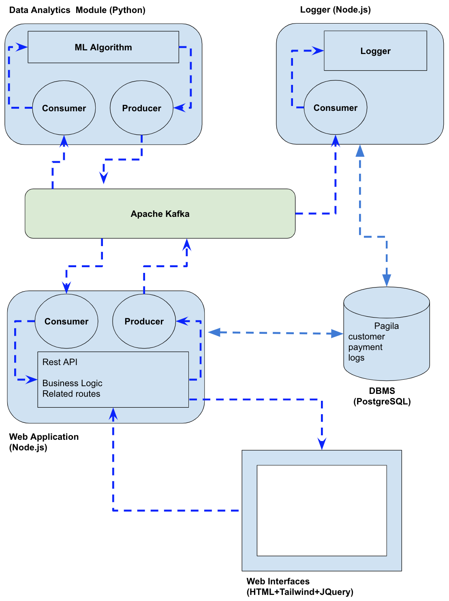

# Module 5: Machine Learning for Decision Support Systems

<!-- TOC -->
* [Module 5: Machine Learning for Decision Support Systems](#module-5-machine-learning-for-decision-support-systems)
* [Artificial Intelligence (AI)](#artificial-intelligence-ai)
* [Introduction To Machine Learning?](#introduction-to-machine-learning)
  * [Part 1: Types of Machine Learning Algorithms](#part-1-types-of-machine-learning-algorithms)
    * [Supervised Learning Algorithms](#supervised-learning-algorithms)
    * [Unsupervised Learning Algorithms](#unsupervised-learning-algorithms)
    * [Neural Networks & Deep Learning](#neural-networks--deep-learning)
  * [Part 2: A General Framework for Developing Machine Learning-Based Algorithms](#part-2-a-general-framework-for-developing-machine-learning-based-algorithms)
    * [Case Study: Linear Regression for Estimating House Prices](#case-study-linear-regression-for-estimating-house-prices)
  * [Part 3: Common ML Algorithms and Their Implementation](#part-3-common-ml-algorithms-and-their-implementation)
    * [Iris Dataset](#iris-dataset)
    * [Logistic Regression](#logistic-regression)
    * [Support Vector Machine (SVM)](#support-vector-machine-svm)
    * [K-Means](#k-means)
    * [Artificial Neural Networks (ANN)](#artificial-neural-networks-ann)
<!-- TOC -->


# Artificial Intelligence (AI)

AI is a broad field of computer science focused on building machines that can perform tasks that typically require human intelligence.

AI is about making machines behave like humans — think, learn, reason, and solve problems.

AI systems aim to mimic human thinking — whether through rules, learning, or problem-solving.


# Introduction To Machine Learning?

Machine Learning (ML) is a subfield of Artificial Intelligence (AI) focused on developing algorithms that can learn 
from data and generalize to new, unseen data. This allows systems to perform tasks without being explicitly programmed. So, ML is a way to teach computers to learn from data instead of giving them step-by-step instructions.


## Part 1: Types of Machine Learning Algorithms

Machine learning algorithms can generally be grouped into three major categories: supervised learning, 
unsupervised learning, and reinforcement learning.

**Supervised Learning**

In supervised learning, models are trained on labeled data — where both input and output are known. 
Supervised learning problems are generally divided into two main types:


- **Classification problem**  
Used when the output is a discrete category or class.
The goal is to assign inputs to one of several predefined categories.
  
  * Predicts **discrete categories** (e.g., classifying an iris flower as *Setosa*, *Versicolor*, or *Virginica*).  
  * **Example:** Spam detection, disease diagnosis.

- **Regression problem**  
Used when the output is a continuous value.
The model predicts a numeric quantity based on the input features.
  * Predicts **continuous values** (e.g., predicting house prices based on area and location).  
  * **Example:** Stock price prediction, temperature forecasting.


**Unsupervised Learning**

Unsupervised learning deals with unlabeled data — the goal is to find hidden patterns or groupings.

- **Clustering problem**  
  Groups similar data points based on similarity (e.g., grouping flowers into species based on petal measurements without predefined labels).  
  **Example:** Grouping emails into categories without predefined labels, customer profiling, market segmentation, clustering similar users....

**Reinforcement Learning**  

Reinforcement learning (RL) is a type of machine learning where an agent learns to make decisions by interacting with an environment.

### Supervised Learning Algorithms

**Linear Regression**

- Predicts a continuous numeric output.
- Fits a line that minimizes the sum of squared errors.

**Logistic Regression**

- Used for binary classification.
- Uses a sigmoid function to predict probabilities.

**Support Vector Machine (SVM)**

- Classifies data by finding the optimal decision boundary.
- Uses kernel functions for non-linear classification.

**K-Nearest Neighbors (KNN)**

- Non-parametric algorithm for regression and classification.
- Predicts based on the average (or majority) of K nearest neighbors.

**Naive Bayes**

- Based on Bayes’ Theorem.
- Assumes feature independence.
- Common in spam filtering.

**Decision Trees**

- Series of conditional questions leading to a prediction.
- Splits data based on feature values.

**Random Forest**

- Ensemble of multiple decision trees.
- Reduces overfitting by averaging results.

**Boosting (e.g., AdaBoost, XGBoost)**

- Trains models sequentially.
- Each model focuses on correcting the errors of the previous one.


### Unsupervised Learning Algorithms

**Clustering**

- Groups similar data points.

**K-Means**

- Partitions data into K clusters based on proximity.
- Iteratively updates cluster centers.

**Others**

- Hierarchical Clustering
- DBSCAN

### Neural Networks & Deep Learning

- Inspired by the human brain, composed of layers (input, hidden, output).
- Learns hidden features and complex patterns automatically.
- Deep Learning = multiple hidden layers.
- Common in image and speech recognition.
- Can be used for classification, regression. With unsupervised variations like Autoencoders, Self-Organizing Maps (SOMs), and Deep Embedded Clustering (DEC) allow ANNs to perform clustering.


**Key Concepts**

- **Overfitting**: Good performance on training data but poor on unseen data.
- **Underfitting**: Model is too simple, fails to learn patterns.
- **Hyperparameters**: Tunable settings like `K` in KNN.
- **Feature Engineering**: Creating new input features to improve model performance.


## Part 2: A General Framework for Developing Machine Learning-Based Algorithms

In a typical machine learning application, the procedure is composed of two main steps. The first step 
involves training and building the model using historical data. In supervised learning, this data is 
labeled — meaning it includes both inputs and their corresponding correct outputs — which enables the 
model to learn the mapping between them. In contrast, unsupervised learning relies on unlabeled data, 
where the model explores the structure or patterns in the data without predefined outputs. Once the model 
is trained, it is saved for future use. The second step involves loading the trained model and introducing 
new, unseen inputs to make predictions or extract insights, depending on the learning type.
This enables the model to provide insights or decisions in real-time without retraining. This separation of training 
and inference makes machine learning systems efficient and scalable in practical applications.


### Case Study: Linear Regression for Estimating House Prices

**First Step: Training Algorithm Pseudocode**

1. Start

2. Define input feature matrix `X` with:
   - square footage
   - number of bedrooms

3. Define output target vector `y` with:
   - corresponding house prices

4. Initialize a Linear Regression model

5. Train the model using `model.fit(X, y)`

6. Print the model's:
   - Coefficients (for sqft and bedrooms)
   - Intercept

7. Save the trained model to disk using `joblib.dump()`

8. End

* House Price Prediction Training Application (/part2/hpp-lr-train-build-save-model.py)
```python
import numpy as np
from sklearn.linear_model import LinearRegression
import joblib  # For saving/loading the trained model

# ----------------------------------------------
# Training Data
# Input features: [area in square meters, number of bedrooms]
# Output: price in million KZT
# ----------------------------------------------
X = np.array([
    [90, 2],
    [140, 3],
    [186, 3],
    [232, 4],
    [279, 4]
])

y = np.array([10, 20, 30, 35, 40])  # Target house prices (in million KZT — Kazakhstan Tenge)

# ----------------------------------------------
# Model Training
# Train a Linear Regression model
# The model will learn the best-fit line:
#     price = a * area_in_m2 + b * bedrooms + c
# ----------------------------------------------
model = LinearRegression()
model.fit(X, y)  # Fit the model to the training data

# ----------------------------------------------
# Evaluation: Make a prediction for a new house
# Example: 100 sqft and 3 bedrooms
# ----------------------------------------------
new_house_area_m2 = 110  # 110 square meters - m²
new_house = np.array([[new_house_area_m2, 3]])
predicted_price = model.predict(new_house)
print(f"Predicted price for {new_house_area_m2} m² & 3 bedrooms: {predicted_price[0]:,.2f} million Tenge")

# ----------------------------------------------
# Inspect the learned parameters
# Coefficients represent how much the price changes
# with 1 unit increase in area (m²) or bedrooms
# ----------------------------------------------
print("Coefficient for area (m²) (a):", model.coef_[0])
print("Coefficient for bedrooms (b):", model.coef_[1])
print("Intercept (c):", model.intercept_)

# ----------------------------------------------
# Save the trained model for future use
# ----------------------------------------------
joblib.dump(model, 'linear_house_model.pkl')
print("Model saved as 'linear_house_model.pkl'")

# ----------------------------------------------
# Summary of what the model does during training:
# 1. Initializes with default coefficients (a, b, c)
# 2. Predicts prices on training data
# 3. Measures the prediction error
# 4. Adjusts coefficients to minimize the error
# 5. Repeats the process until the optimal fit is found
# ----------------------------------------------

```


**Second Step:Prediction Application Pseudocode**

1. Start

2. Load the trained model from disk using `joblib.load()`

3. Display "House Price Predictor is ready"

4. LOOP:
    a. Ask user to enter:
       - square footage
       - number of bedrooms

    b. Convert input to numeric values

    c. Create input array for prediction: `[[sqft, bedrooms]]`

    d. Predict house price using `model.predict()`

    e. Display predicted price

    f. Ask user if they want to make another prediction
       - If NO, exit the loop

5. Print "Goodbye"

6. End


* House Price Prediction Console App: User Input from Console (/part2/hpp-lr-load-use-model.py)
```python
import numpy as np
import joblib

# ──────────────────────────────────────────────────────────────
# Load the trained Linear Regression model from file
# This model was trained to predict house prices based on:
#    - area (in square meters)
#    - number of bedrooms
# The target price was expressed in **millions of Kazakhstani Tenge (KZT)**
# ──────────────────────────────────────────────────────────────
model = joblib.load('linear_house_model.pkl')
print("House Price Predictor is ready!")

# ──────────────────────────────────────────────────────────────
# User Interaction Loop: Repeats until user exits
# ──────────────────────────────────────────────────────────────
while True:
    try:
        # Prompt user for square footage input (in square meters)
        sqft = float(input("Enter area in square meters (e.g., 100): "))

        # Prompt user for number of bedrooms
        bedrooms = int(input("Enter number of bedrooms (e.g., 3): "))

        # Prepare the input in the format expected by the model: 2D array
        user_input = np.array([[sqft, bedrooms]])

        # Predict the price using the model
        predicted_price = model.predict(user_input)

        # Output the result — rounded to 2 decimals, expressed in million KZT
        print(f"Predicted house price: {predicted_price[0]:,.2f} million KZT")

        # Ask user if they want to make another prediction
        cont = input("Do you want to predict another house? (yes/no): ").strip().lower()
        if cont not in ['yes', 'y']:
            print("Goodbye")
            break

    except Exception as e:
        # If invalid input or error in prediction
        print(f"Error: {e}. Please try again.\n")

```


* House Price Prediction Application: User Input via Apache Kafka (/part2/hpp-lr-load-use-model-with-kafka.py)



```python
import json
import numpy as np
import joblib
from confluent_kafka import Consumer, KafkaException, KafkaError, Producer

# ───────────────────────────────────────────────────────────────
# Configuration
# ───────────────────────────────────────────────────────────────
KAFKA_BROKER = 'localhost:9092'  # Kafka broker address
INPUT_TOPIC = 'dss-ml-house-price-model-input'  # Input topic for receiving data
OUTPUT_TOPIC = 'dss-ml-house-price-model-output'  # Output topic for sending predictions
GROUP_ID = 'house-price-consumer-group'  # Kafka consumer group ID
MODEL_PATH = 'linear_house_model.pkl'  # Path to the saved model file

# ───────────────────────────────────────────────────────────────
# Load ML Model
# ───────────────────────────────────────────────────────────────
model = joblib.load(MODEL_PATH)  # Load the trained model from file
print("House Price Predictor is ready.")

# ───────────────────────────────────────────────────────────────
# Kafka Consumer Configuration
# ───────────────────────────────────────────────────────────────
consumer_conf = {
    'bootstrap.servers': KAFKA_BROKER,  # Kafka broker address
    'group.id': GROUP_ID,  # Consumer group ID
    'auto.offset.reset': 'latest'  # Start reading from the latest message
}
consumer = Consumer(consumer_conf)  # Create a Kafka consumer
consumer.subscribe([INPUT_TOPIC])  # Subscribe to the input topic

# ───────────────────────────────────────────────────────────────
# Kafka Producer Configuration
# ───────────────────────────────────────────────────────────────
producer_conf = {
    'bootstrap.servers': KAFKA_BROKER  # Kafka broker address for the producer
}
producer = Producer(producer_conf)  # Create a Kafka producer

# ───────────────────────────────────────────────────────────────
# Delivery Callback for Producer
# ───────────────────────────────────────────────────────────────
def delivery_report(err, msg):
    """
    This callback function will be called after a message is sent to Kafka.
    It logs the result of the delivery attempt.
    """
    if err is not None:
        print(f"Delivery failed: {err}")
    else:
        print(f"Prediction sent to {msg.topic()} [partition {msg.partition()}] at offset {msg.offset()}")

# ───────────────────────────────────────────────────────────────
# Main Processing Loop
# ───────────────────────────────────────────────────────────────
try:
    while True:
        msg = consumer.poll(timeout=1.0)  # Poll Kafka for messages with a 1-second timeout

        if msg is None:
            continue  # No new message, keep waiting
        elif msg.error():
            if msg.error().code() == KafkaError._PARTITION_EOF:  # End of partition reached
                print(f"End of partition at {msg.partition()} offset {msg.offset()}")
            else:
                raise KafkaException(msg.error())  # Raise error if it's not EOF
        else:
            try:
                # Parse JSON input message
                message_value = msg.value().decode('utf-8')  # Decode the message from bytes to string
                message_json = json.loads(message_value)  # Convert JSON string to a Python dictionary

                print("Received message: " + json.dumps(message_json))  # Log received message

                # Extract features from the message (area in square meters and number of bedrooms)
                sqft = message_json['sqft']
                bedrooms = message_json['bedrooms']

                # Prepare the input data for prediction
                user_input = np.array([[sqft, bedrooms]])

                # Predict the price using the trained model
                predicted_price = model.predict(user_input)[0]

                # Output the prediction
                print(f"Predicted house price: {predicted_price:,.2f}")  

                # Create JSON result with predicted price
                result_json = json.dumps({
                    "sqft": sqft,
                    "bedrooms": bedrooms,
                    "predicted_price": round(predicted_price, 2)  # Round the predicted price to 2 decimal places
                })

                # Send the prediction result to the output Kafka topic
                producer.produce(
                    topic=OUTPUT_TOPIC,
                    value=result_json,
                    callback=delivery_report  # Callback function for delivery confirmation
                )
                producer.flush()  # Ensure the message is sent to Kafka

            except Exception as e:
                print(f"Error processing message: {e}\n")  # Log error if something goes wrong

except KeyboardInterrupt:
    # ──────────────────────────────────────────────────────────────
    # Gracefully handle keyboard interrupt (Ctrl+C)
    # ──────────────────────────────────────────────────────────────
    print("Exiting...")

finally:
    # ──────────────────────────────────────────────────────────────
    # Close the Kafka consumer to clean up resources
    # ──────────────────────────────────────────────────────────────
    consumer.close()

# ───────────────────────────────────────────────────────────────────
# Expected Message Format from Kafka (example):
# { "sqft": 2200, "bedrooms": 3 }
# ───────────────────────────────────────────────────────────────────


```

## Part 3: Common ML Algorithms and Their Implementation

### Iris Dataset

https://www.kaggle.com/datasets/uciml/iris

This application uses the **Iris dataset**, a classical dataset in the field of machine learning and pattern recognition. 
It consists of 150 samples of iris flowers from three different species: *Iris setosa*, *Iris versicolor*, 
and *Iris virginica*.

Each sample includes the following numerical features:

- Sepal Length (in cm)
- Sepal Width (in cm)
- Petal Length (in cm)
- Petal Width (in cm)

The Iris dataset is included as part of many ML libraries such as `scikit-learn`, making it easy to load and use 
in Python-based machine learning models.

In the following  apps, only **Sepal Length** and **Sepal Width** are used as input features to simplify the operations. 


**Test Data for the Iris dataset**

| Sepal Length (cm) | Sepal Width (cm) | Expected Class  |
|-------------------|------------------|---|
| 5.1	              | 3.5              | setosa  |
| 6.0               | 2.2              | versicolor  |
| 6.3               | 3.3              | virginica  |
| 4.9               | 3.1              | setosa  |


### Logistic Regression

```python
# -----------------------------
# Import necessary libraries
# -----------------------------
import numpy as np
import matplotlib.pyplot as plt
import joblib                                     # For saving model and scaler
from sklearn import datasets
from sklearn.model_selection import train_test_split
from sklearn.preprocessing import StandardScaler
from sklearn.linear_model import LogisticRegression
from sklearn.metrics import accuracy_score, classification_report


# -----------------------------
# Load and prepare the Iris dataset
# -----------------------------
iris = datasets.load_iris()
X = iris.data[:, :2]  # Take only the first two features (sepal length & width) for easy visualization
y = iris.target       # Labels (0 = Setosa, 1 = Versicolor, 2 = Virginica)

# Split data into training and testing sets (80% train, 20% test)
X_train, X_test, y_train, y_test = train_test_split(X, y, test_size=0.2, random_state=42)


# -----------------------------
# Standardize the features
# -----------------------------
scaler = StandardScaler()
X_train = scaler.fit_transform(X_train)
X_test = scaler.transform(X_test)


# -----------------------------
# Train Logistic Regression model
# -----------------------------
log_reg = LogisticRegression(multi_class='multinomial', solver='lbfgs', max_iter=200)
log_reg.fit(X_train, y_train)


# -----------------------------
# Save model and scaler
# -----------------------------
joblib.dump(log_reg, 'logistic_model.pkl')   # Save trained logistic regression model
joblib.dump(scaler, 'scaler.pkl')            # Save fitted scaler


# -----------------------------
# Predict and evaluate
# -----------------------------
y_pred = log_reg.predict(X_test)

accuracy = accuracy_score(y_test, y_pred)
print(f"Model Accuracy: {accuracy:.2f}")
print("\nClassification Report:\n", classification_report(y_test, y_pred))


# -----------------------------
# Function to plot decision boundary
# -----------------------------
def plot_decision_boundary(model, X, y):
    """Function to plot decision boundary for Logistic Regression"""
    h = 0.02  # Step size for mesh
    x_min, x_max = X[:, 0].min() - 1, X[:, 0].max() + 1
    y_min, y_max = X[:, 1].min() - 1, X[:, 1].max() + 1
    xx, yy = np.meshgrid(np.arange(x_min, x_max, h),
                         np.arange(y_min, y_max, h))

    # Predict class labels for each point in the grid
    Z = model.predict(scaler.transform(np.c_[xx.ravel(), yy.ravel()]))
    Z = Z.reshape(xx.shape)

    # Plot decision boundary
    plt.contourf(xx, yy, Z, alpha=0.3, cmap=plt.cm.coolwarm)

    # Scatter plot of data points
    plt.scatter(X[:, 0], X[:, 1], c=y, edgecolors='k', cmap=plt.cm.coolwarm, marker="o")

    plt.xlabel("Sepal Length")
    plt.ylabel("Sepal Width")
    plt.title("Logistic Regression Decision Boundary on Iris Dataset")
    plt.show()


# -----------------------------
# Visualize the decision boundary
# -----------------------------
plot_decision_boundary(log_reg, X, y)

```

### Support Vector Machine (SVM)

```python
# -----------------------------
# Import necessary libraries
# -----------------------------
import numpy as np
import matplotlib.pyplot as plt
import joblib                              # For saving model and scaler
from sklearn import datasets
from sklearn.model_selection import train_test_split
from sklearn.preprocessing import StandardScaler
from sklearn.svm import SVC
from sklearn.metrics import accuracy_score, classification_report


# -----------------------------
# Load and prepare the dataset
# -----------------------------
iris = datasets.load_iris()                # Load Iris dataset
print(iris)                                # Print dataset description
X = iris.data[:, :2]                       # Use first two features for 2D visualization
y = iris.target                            # Labels (0 = Setosa, 1 = Versicolor, 2 = Virginica)


# -----------------------------
# Split and standardize the data
# -----------------------------
X_train, X_test, y_train, y_test = train_test_split(X, y, test_size=0.2, random_state=42)

scaler = StandardScaler()
X_train = scaler.fit_transform(X_train)
X_test = scaler.transform(X_test)


# -----------------------------
# Train SVM model
# -----------------------------
svm_model = SVC(kernel='rbf', C=1.0, gamma='scale')  # RBF kernel
svm_model.fit(X_train, y_train)                      # Train the model


# -----------------------------
# Evaluate the model
# -----------------------------
y_pred = svm_model.predict(X_test)
accuracy = accuracy_score(y_test, y_pred)

print(f"Model Accuracy: {accuracy:.2f}")
print("\nClassification Report:\n", classification_report(y_test, y_pred))


# -----------------------------
# Save the model and scaler
# -----------------------------
joblib.dump(svm_model, 'svm_model.pkl')    # Save trained SVM model
joblib.dump(scaler, 'scaler.pkl')          # Save fitted scaler


# -----------------------------
# Function to plot decision boundary
# -----------------------------
def plot_decision_boundary(model, X, y):
    """
    Function to plot decision boundary of SVM.
    """
    h = 0.02  # Step size for mesh grid
    x_min, x_max = X[:, 0].min() - 1, X[:, 0].max() + 1
    y_min, y_max = X[:, 1].min() - 1, X[:, 1].max() + 1

    xx, yy = np.meshgrid(np.arange(x_min, x_max, h),
                         np.arange(y_min, y_max, h))

    # Predict on mesh grid
    Z = model.predict(scaler.transform(np.c_[xx.ravel(), yy.ravel()]))
    Z = Z.reshape(xx.shape)

    # Plot contour and data points
    plt.contourf(xx, yy, Z, alpha=0.3, cmap=plt.cm.coolwarm)
    plt.scatter(X[:, 0], X[:, 1], c=y, edgecolors='k', cmap=plt.cm.coolwarm)

    plt.xlabel("Sepal Length")
    plt.ylabel("Sepal Width")
    plt.title("SVM Decision Boundary on Iris Dataset")
    plt.show()


# -----------------------------
# Visualize decision boundary
# -----------------------------
plot_decision_boundary(svm_model, X, y)

```

### K-Means

```python
# -----------------------------
# Import necessary libraries
# -----------------------------
import numpy as np
import matplotlib.pyplot as plt
import joblib                              # For saving model and scaler
from sklearn import datasets
from sklearn.preprocessing import StandardScaler
from sklearn.cluster import KMeans


# -----------------------------
# Load and prepare the Iris dataset
# -----------------------------
iris = datasets.load_iris()                # Load the dataset containing flower measurements
X = iris.data[:, :2]                       # Use only the first two features for easy 2D visualization
y = iris.target                            # True labels (used only for visualization, not for training)


# -----------------------------
# Standardize the features
# -----------------------------
scaler = StandardScaler()
X_scaled = scaler.fit_transform(X)         # Transform the data to have zero mean and unit variance


# -----------------------------
# Apply K-Means clustering
# -----------------------------
kmeans = KMeans(n_clusters=3, random_state=42, n_init=10)
y_kmeans = kmeans.fit_predict(X_scaled)    # Fit K-Means and assign each data point to a cluster


# -----------------------------
# Save the fitted model and scaler
# -----------------------------
joblib.dump(kmeans, 'kmeans_model.pkl')    # Save trained K-Means model
joblib.dump(scaler, 'scaler.pkl')          # Save fitted scaler


# -----------------------------
# Function to plot decision boundaries
# -----------------------------
def plot_decision_boundary_kmeans(model, X):
    """
    Function to visualize the decision boundaries of K-Means clustering.
    It generates a grid of points, predicts their cluster assignments, and plots them as a background color.
    """
    h = 0.02  # Step size of the grid for plotting decision regions
    x_min, x_max = X[:, 0].min() - 1, X[:, 0].max() + 1  # Define x-axis range
    y_min, y_max = X[:, 1].min() - 1, X[:, 1].max() + 1  # Define y-axis range

    # Create a mesh grid (a grid of points covering the entire feature space)
    xx, yy = np.meshgrid(np.arange(x_min, x_max, h),
                         np.arange(y_min, y_max, h))

    # Predict the cluster for each point in the grid
    Z = model.predict(np.c_[xx.ravel(), yy.ravel()])
    Z = Z.reshape(xx.shape)  # Reshape to match the grid shape for visualization

    # Plot the decision boundary using filled contour plot
    plt.contourf(xx, yy, Z, alpha=0.3, cmap=plt.cm.coolwarm)

    # Scatter plot of actual data points, colored by their predicted cluster
    plt.scatter(X[:, 0], X[:, 1], c=y_kmeans, edgecolors='k', cmap=plt.cm.coolwarm, marker="o", label="Data Points")

    # Plot centroids of the clusters
    centroids = model.cluster_centers_
    plt.scatter(centroids[:, 0], centroids[:, 1], s=200, c='yellow', edgecolors='k', marker="X", label="Centroids")

    # Labels and title
    plt.xlabel("Sepal Length (Standardized)")
    plt.ylabel("Sepal Width (Standardized)")
    plt.title("K-Means Clustering on Iris Dataset")
    plt.legend()
    plt.show()


# -----------------------------
# Visualize the clustering result
# -----------------------------
plot_decision_boundary_kmeans(kmeans, X_scaled)

```

### Artificial Neural Networks (ANN)

```python
# -----------------------------
# Import necessary libraries
# -----------------------------
import numpy as np
import matplotlib.pyplot as plt
import tensorflow as tf
from tensorflow import keras
import joblib                                # For saving model and scaler
from sklearn import datasets
from sklearn.model_selection import train_test_split
from sklearn.preprocessing import StandardScaler
from sklearn.metrics import accuracy_score, classification_report


# -----------------------------
# Load and prepare the dataset
# -----------------------------
iris = datasets.load_iris()  # Load Iris dataset
X = iris.data[:, :2]         # Use first two features for 2D visualization
y = iris.target              # Labels (0 = Setosa, 1 = Versicolor, 2 = Virginica)


# -----------------------------
# Split and standardize the data
# -----------------------------
X_train, X_test, y_train, y_test = train_test_split(X, y, test_size=0.2, random_state=42)

scaler = StandardScaler()
X_train = scaler.fit_transform(X_train)
X_test = scaler.transform(X_test)


# -----------------------------
# Convert labels to one-hot encoding
# -----------------------------
y_train_onehot = keras.utils.to_categorical(y_train, num_classes=3)
y_test_onehot = keras.utils.to_categorical(y_test, num_classes=3)


# -----------------------------
# Build and compile the ANN model
# -----------------------------
model = keras.Sequential([
    keras.layers.Dense(10, activation='relu', input_shape=(2,)),  # Hidden Layer 1 (10 neurons, ReLU)
    keras.layers.Dense(10, activation='relu'),  # Hidden Layer 2 (10 neurons, ReLU)
    keras.layers.Dense(3, activation='softmax')  # Output Layer (3 neurons for 3 classes, Softmax for probabilities)
])

model.compile(optimizer='adam',
              loss='categorical_crossentropy',
              metrics=['accuracy'])


# -----------------------------
# Train the model
# -----------------------------
history = model.fit(X_train, y_train_onehot, epochs=100, verbose=0, batch_size=5)  # Train with 100 epochs


# -----------------------------
# Predict and evaluate the model
# -----------------------------
y_pred_prob = model.predict(X_test)  # Get probabilities
y_pred = np.argmax(y_pred_prob, axis=1)  # Convert probabilities to class labels

accuracy = accuracy_score(y_test, y_pred)
print(f"Model Accuracy: {accuracy:.2f}")
print("\nClassification Report:\n", classification_report(y_test, y_pred))


# -----------------------------
# Save the model and scaler
# -----------------------------
model.save('ann_model.keras')  # Save trained ANN model in Keras format
joblib.dump(scaler, 'scaler.pkl')        # Save fitted scaler


# -----------------------------
# Function to plot decision boundary
# -----------------------------
def plot_decision_boundary_ann(model, X, y):
    """
    Function to visualize ANN decision boundary
    """
    h = 0.02  # Step size for mesh grid
    x_min, x_max = X[:, 0].min() - 1, X[:, 0].max() + 1
    y_min, y_max = X[:, 1].min() - 1, X[:, 1].max() + 1
    xx, yy = np.meshgrid(np.arange(x_min, x_max, h),
                         np.arange(y_min, y_max, h))

    # Predict for each mesh point
    Z = model.predict(scaler.transform(np.c_[xx.ravel(), yy.ravel()]))
    Z = np.argmax(Z, axis=1)  # Convert probabilities to class labels
    Z = Z.reshape(xx.shape)

    # Plot decision boundary
    plt.contourf(xx, yy, Z, alpha=0.3, cmap=plt.cm.coolwarm)

    # Scatter plot of actual data points
    plt.scatter(X[:, 0], X[:, 1], c=y, edgecolors='k', cmap=plt.cm.coolwarm)

    plt.xlabel("Sepal Length")
    plt.ylabel("Sepal Width")
    plt.title("ANN Decision Boundary on Iris Dataset")
    plt.show()


# -----------------------------
# Visualize the decision boundary
# -----------------------------
plot_decision_boundary_ann(model, X, y)

```


